# Themes — Self-Contained Design Systems

This folder contains seven design systems, one per theme, treated as standalone bundles. Each theme defines its own visual identity (tokens, CSS, icons, optional sounds and shells) and can in principle be lifted out and applied to a different application.

## Bundle layout

Each theme lives in its own folder:

```
themes/
  _shared/                tokens.ts, capabilities.ts, hooks/, anchor-colors.ts, CASCADE_PITFALLS.md
  default/                "Scene It" — modern dark zinc + teal
  sc3ne_it/               cyberpunk amber-orange (hidden from picker)
  sciin_it/               "(SCII)n_it" — CGA terminal / ASCII roguelike
  scenit/                 neubrutalist teal + magenta
  win95/                  "sceneit.exe" — Windows 95 skeuomorphic
  winamp/                 "scene it.mp3" — Winamp 5 brushed metal
  xX_sCeNeIt_Xx/          AOL Instant Messenger / Windows XP Luna
  decorations.css         aggregator that @imports every per-theme CSS file
  index.ts                public API: tokens, hooks, registry, capabilities
```

A complete theme bundle contains some or all of:

| File | Purpose |
|---|---|
| `tokens.ts` | The `UITheme` object: surfaces, text, accents, geometry, fonts |
| `capabilities.ts` | `ThemeCapabilities` entry — branching behaviors (covered in `_shared/capabilities.ts`) |
| `decorations.css` | All `[data-theme="..."]` CSS for this theme (bevels, gradients, scrollbars, etc.) |
| `icons.tsx` | Per-theme icon set (when the theme deviates from Lucide) |
| `sounds.ts` | Sound-effect hooks (AIM only) |
| `window-manager.tsx` | Bespoke window manager (Winamp + AIM only) |
| `shells/` | Theme-specific shell components (windowing chrome, decorative frames) |
| `README.md` | Design spec for the theme |

## How the system works

Three layers, increasing per-theme cost:

```mermaid
flowchart TB
    subgraph A [Layer A: tokens scale automatically]
        Tokens[UITheme objects]
        Tailwind[Tailwind utility classes]
        Tokens --> Tailwind
        Tailwind --> ConsumerA[Component using bg-surface-primary, text-content-secondary, etc.]
    end
    subgraph B [Layer B: per-theme CSS scales per-theme]
        DataTheme["html data-theme attribute"]
        Decorations["per-theme decorations.css"]
        DataTheme --> Decorations
        Decorations --> ConsumerB[Component receives theme-specific bevels, gradients, scrollbars]
    end
    subgraph C [Layer C: capabilities scales okay]
        Capabilities["ThemeCapabilities object"]
        Hook["useThemeCapabilities hook"]
        Capabilities --> Hook
        Hook --> ConsumerC[Component branches on cap.checkboxStyle, cap.iconStyle, etc.]
    end
```



- **Layer A — tokens**: ~22 CSS variables per theme. `applyUITheme()` writes them to `<html>`, Tailwind exposes them as `bg-surface-primary`, `rounded-theme`, `font-sans`, etc. Components built only on these utility classes adapt to all themes for free.
- **Layer B — CSS decorations**: ~13K lines of `[data-theme="..."]` overrides for things tokens cannot express (raised/sunken bevels, brushed-metal gradients, ASCII borders, scrollbar pseudo-elements). Each theme owns its slice in `themes/<id>/decorations.css`; `themes/decorations.css` aggregates them via `@import`. Per-theme `@font-face` declarations (Tahoma, W95FA, DSEG7) live at the top of the owning theme's decorations.css so each bundle ships its own fonts.
- **Layer C — capabilities**: 7 enumerated branches (icon style, checkbox style, slider style, section header style, layout shell, etc.) plus boolean flags. Components that need to fork rendering (e.g., `<ThemeToggle>` vs ASCII brackets vs Win95 SVG checkmark) call `useThemeCapabilities()` and switch on `cap.checkboxStyle`. The capability map is the single source of truth for "what makes theme X different from theme Y."

## Theme switching

`applyUITheme(theme)` sets `data-theme` on `<html>` and writes the token vars. A `MutationObserver` in `useThemeId` notifies React, which re-runs `useThemeCapabilities()` and swaps any layout branches. The PlyCanvas viewport is preserved across switches via [lib/canvas-portal.tsx](../lib/canvas-portal.tsx), which keeps the renderer mounted in an offscreen holder and DOM-reparents it into the active layout.

## Cascade pitfalls

Per-theme CSS rules are aggressive (e.g., `[data-theme="win95"] *` forces 13px font on every element). When adding new components, consult [_shared/CASCADE_PITFALLS.md](_shared/CASCADE_PITFALLS.md) for the documented footguns.

## Adding a new theme

1. Create a folder `themes/<your-id>/`
2. Add `tokens.ts` exporting a `UITheme` object (use one of the existing themes as a template)
3. Add an entry in [_shared/capabilities.ts](_shared/capabilities.ts) `THEME_CAPABILITIES` map — pick capability values that match closest existing themes
4. Add `decorations.css` (can start empty if tokens cover everything)
5. Add the import to [decorations.css](decorations.css)
6. Re-export the theme from [index.ts](index.ts) and add it to `UI_THEMES`
7. Optionally add `icons.tsx`, `shells/`, sounds, fonts — wire them via the capability flags

## Lifting a theme to another project

Each per-theme README (`themes/<id>/README.md`) ships an exact `cp` recipe under its "Lifting to another project" section. The general shape is:

```bash
cp -r themes/<id>/                  DEST/themes/<id>/
cp -r public/icons/<id>/            DEST/public/icons/<id>/      # if the theme has icons
cp -r public/fonts/<id>/            DEST/public/fonts/<id>/      # if the theme has fonts
cp -r public/sounds/<id>/           DEST/public/sounds/<id>/     # if the theme has sounds (AIM only)
cp    themes/_shared/tokens.ts      DEST/themes/_shared/tokens.ts
cp    themes/_shared/capabilities.ts DEST/themes/_shared/capabilities.ts
```

Then at app startup:

```ts
import { applyUITheme, THEME_X } from "@/themes";
applyUITheme(THEME_X);
```

Plus `@import "themes/<id>/decorations.css"` in your global stylesheet, and a Tailwind preset that maps the CSS vars to your project's color scale (mirror [tailwind.config.ts](../tailwind.config.ts) lines 11-37).

Theme-specific shells (`XPDesktop`, `WinampDesktop`, `Win95Taskbar`, `Win95ViewportChrome`, `AIMBuddyList`, etc.) live under each theme's `shells/` folder. Most assume a viewer-like host (scene context, anchors, paths). Per-theme READMEs flag what's cleanly extractable vs tightly coupled.
